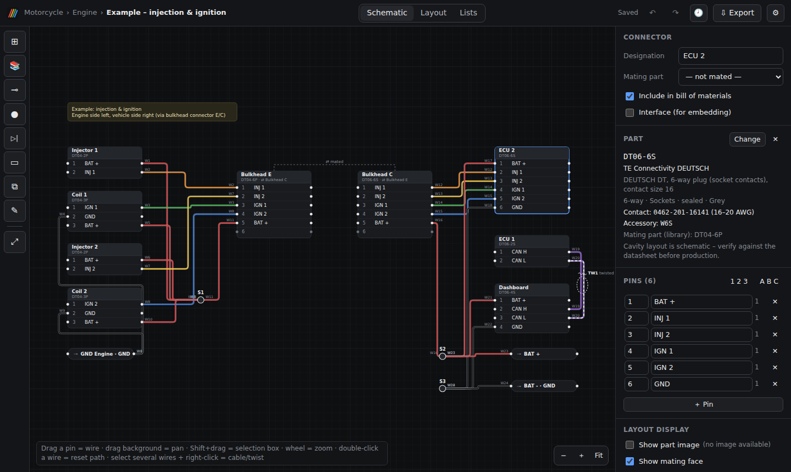
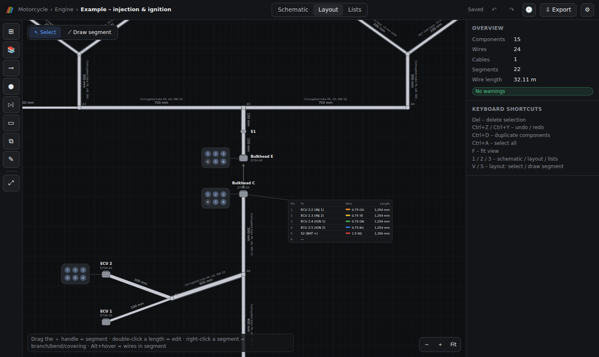
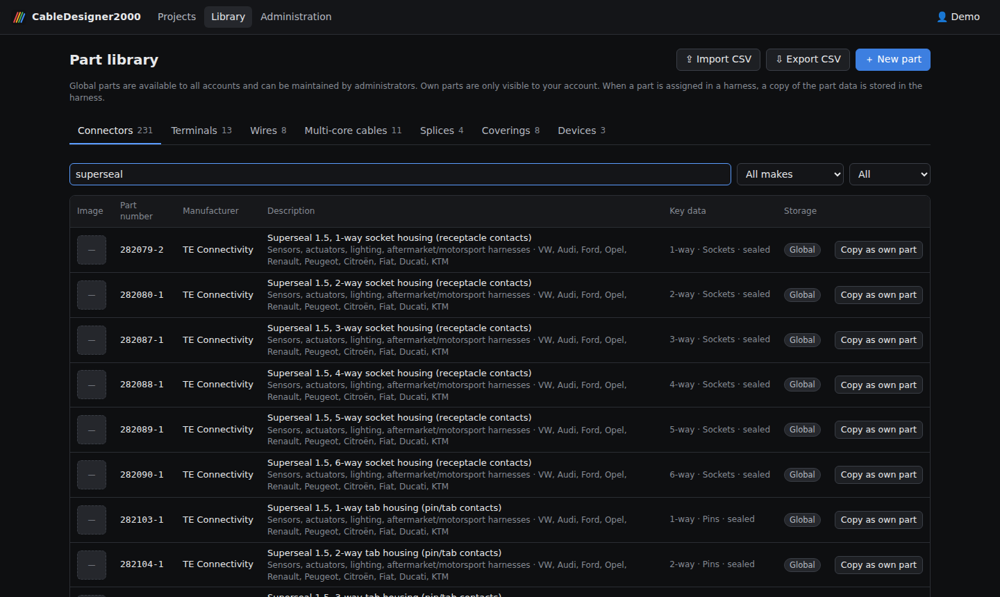

# CableDesigner2000

Web-based cable harness designer for private projects – inspired by harness.design.
Self-hosted (Docker), multiple user accounts, projects with sub-projects, sharing, a part library,
schematic and layout views with automatic wire-length calculation, and export as print/PDF, image and Excel.
The user interface is available in German and English (switchable per account).



| Layout with segment lengths, mating faces and wire table | Part library with researched connector systems |
|---|---|
|  |  |

---

## Features (version 0.2)

**Accounts & projects**
- The initial setup creates the first administrator; further accounts are created by an administrator under *Administration*.
- Projects with arbitrarily nested sub-projects; any number of harnesses on every level.
- Share a project (including all sub-projects) with other accounts as *read* or *edit*.
  Administrators only see other users' projects through shares.
- Rename, duplicate, move harnesses; export/import them as JSON.
- Autosave with conflict detection (two people editing at the same time).
- UI language German/English, stored per account.

**Schematic**
- Connectors (free or from the library), terminals (ring, fork, ferrule, tab, receptacle, open end), splices,
  diode, resistor, notes.
- Wires by dragging from pin to pin; colour (IEC 60757) with stripe colour, cross-section (mm² with AWG), wire type.
- Connector mating (e.g. bulkhead E ⇄ C) – circuits are traced through mated connectors.
- **Multi-core cables and twisted wires** as objects of their own: select several wires → right-click →
  *Combine into multi-core cable …* or *Twist …*. Cables can take a library cable (e.g. LiYCY 4×0.5) whose core
  colours are applied to the wires; a shield can be assigned as its own wire (drawn dashed).
- **Embedded sub-harnesses** (⧉): another harness is linked as a block showing its interface connectors.
  Changes to the original are picked up automatically; the block's connectors can be mated with connectors of the
  parent harness. Loops (A embeds B embeds A) are rejected.
- Hover highlighting, selection box, duplicate, undo/redo.

**Layout / formboard**
- Draw segments between components and branch points, T-branches by dragging onto a segment,
  bend points, segment lengths in mm, coverings (corrugated tube, tape, braid, heat shrink).
- Every wire is routed through the segment network automatically (shortest path), which gives its length.
  Wires pass branch points, splices and devices, but not connectors or terminals.
- Per connector: part image, mating face (cavity layout) and wire table can be shown.
- Estimated bundle diameter per segment (warning if larger than the covering).

**Wire length**

```
length = path in layout × (1 + allowance %) × twist factor + 2 × extra per wire end + extra length of the wire
twist factor = √(1 + (π · d / lay length)²)     (only for twisted wires; d = wire outer diameter)
```

Allowance and extra per end are set in the harness settings (⚙). A fixed length can be entered per wire, which
replaces the calculation.

**Lists & exports**
- Wire list, bill of materials (incl. contacts per used cavity, single wire seals, secondary locks; sub-harnesses
  either as an assembly or exploded), pin assignment, cables, segments, checks.
- **Print / PDF**: schematic and layout fitted to the page with a title block (drawing number, revision, author, date),
  plus selectable lists; A4/A3, portrait/landscape. Choose "Save as PDF" in the browser's print dialog.
- **Formboard 1:1** over several pages: the layout is redrawn to scale from the segment lengths and split into tiles
  with 10 mm overlap, 50 mm grid, a 100 mm check scale on every sheet and an overview page. Empty tiles are skipped.
  Print at 100 % ("actual size").
- **Image**: PNG (1×/2×/3×) or SVG, light or dark.
- **Excel** (.xlsx): sheets *Wire list*, *BOM*, *BOM (exploded)*, *Pin assignment*, *Cables*, *Segments*, *Info*.

**Revision history**
- While editing, the previous state is kept automatically at most every 10 minutes (the latest 50 are kept).
- Named revisions (e.g. "B" or "Release prototype") are kept permanently and can optionally set the revision in the
  title block.
- Compare any revision with the current state (components, wires, cables, segments, settings) and restore it –
  the current state is backed up as a revision first.

**Part library**
- Global library (for all accounts, maintained by administrators) and own parts per account, each with image upload.
- Pre-filled with roughly 280 parts, including
  - vehicle connector systems used across many makes: TE Superseal 1.5, MQS, JPT, Bosch Jetronic/Compact,
    Aptiv (Delphi) Weather Pack, Metri-Pack 150/280, GT 150/280, Molex MX150, OBD-II (SAE J1962),
    DEUTSCH DT/DTM/DTP/HD10/HD30 – each with the vehicle makes that typically use them (filter by make),
  - common industrial/hobby connectors: JST SH/GH/ZH/PH/EH/XH/VH/PA/SM/RCY, Molex KK 254, Micro-Fit 3.0,
    Mini-Fit Jr., PicoBlade, TE MATE-N-LOK, M12 (A/B/D/X-coded) and M8, Anderson Powerpole/SB50, XT30/XT60/XT90,
  - FLRY-B wires, LiYY/LiYCY multi-core cables (DIN 47100 colours), terminals, splices, coverings, diodes/resistor.
  Entries without a part number are generic placeholders for families whose part numbers could not be verified.
- **CSV import/export** of parts lists (separator detected automatically, English or German column names, template
  download, skip or update existing part numbers).
- When a part is assigned, a copy of its data is stored in the harness – later library changes do not alter
  existing harnesses.

> **Note:** The mating-face layouts of the pre-filled parts are schematic, and part numbers were researched from
> manufacturer and distributor pages (see `data.url` of each part). Always verify cavity numbering, contacts and seals
> against the manufacturer datasheet before production.

---

## Installation with Docker

A ready-made image is published to the GitHub Container Registry by GitHub Actions on every push to `main`
(`ghcr.io/tenofnine/cabledesigner2000`, for linux/amd64 and linux/arm64):

| Tag | Content |
|-----|---------|
| `latest` | newest state of `main` |
| `0.2.0`, `0.2` | releases (Git tags `v0.2.0` …) |
| `sha-abc1234` | a specific commit |

All data (users, projects, harnesses, library incl. images) is stored in one SQLite file in the Docker volume
`cabledesigner2000-data` (`/data/cabledesigner.db` inside the container). On first access of the UI the
**initial setup** for the administrator account appears.

### Portainer

1. **Stacks → Add stack**, give it a name (e.g. `cabledesigner2000`) and choose **Repository**.
2. **Repository URL:** `https://github.com/TenOfNine/CableDesigner2000`, **Repository reference:** `refs/heads/main`,
   **Compose path:** `docker-compose.yml` (no authentication needed – the repository is public).
3. Optional: set **Environment variables** (see the table below, or load `.env.example` as a template).
4. **Deploy the stack.** The UI is then available at `http://<server>:8080` (or the port set in `HTTP_PORT`).

Instead of a repository stack, the content of `docker-compose.yml` can also be pasted into the **Web editor**.

**Updating:** open the stack and click **Pull and redeploy** with **Re-pull image** enabled
(web-editor stacks: **Update the stack** with re-pulling the image). The database schema and the built-in library are
upgraded automatically on start; library parts you edited yourself are not overwritten.
To stay on a fixed version, set `IMAGE_TAG` (e.g. `0.2.0`).

### Docker Compose

```bash
git clone https://github.com/TenOfNine/CableDesigner2000.git
cd CableDesigner2000
cp .env.example .env        # optional: adjust the settings
docker compose up -d
```

Update with `git pull && docker compose pull && docker compose up -d`.

To build the image from the local source instead of pulling it:

```bash
docker compose -f docker-compose.yml -f docker-compose.build.yml up -d --build
```

### Settings (environment variables)

Variables used by `docker-compose.yml` (Portainer: *Environment variables*; Docker Compose: `.env`):

| Variable        | Default  | Meaning |
|-----------------|----------|---------|
| `IMAGE_TAG`     | `latest` | Image tag to run (`latest`, a release such as `0.2.0`, or `sha-…`) |
| `HTTP_PORT`     | `8080`   | Port on the Docker host |
| `COOKIE_SECURE` | `false`  | Set to `true` once the UI is only accessed via HTTPS |
| `TRUST_PROXY`   | empty    | Behind a reverse proxy e.g. `1` (correct client IP for login throttling) |
| `SESSION_DAYS`  | `30`     | Validity of a login in days (extended while in use) |

Inside the container the server also reads `PORT` (default `8080`) and `DATA_DIR` (default `/data`); there is
normally no reason to change them.

### Behind a reverse proxy (recommended for access from outside)

Example nginx:

```nginx
location / {
    proxy_pass http://127.0.0.1:8080;
    proxy_set_header Host $host;
    proxy_set_header X-Forwarded-For $proxy_add_x_forwarded_for;
    proxy_set_header X-Forwarded-Proto $scheme;
    client_max_body_size 10m;
}
```

Then set `COOKIE_SECURE=true` and `TRUST_PROXY=1`.

### Backup and restore

- **Backup:** *Administration → Database backup* downloads a consistent copy of the database (works while running).
- **Restore:** stop the container, copy the backup file into the volume as `cabledesigner.db`, start the container:

```bash
docker compose stop
docker run --rm -v cabledesigner2000-data:/data -v "$PWD":/backup alpine \
  sh -c "rm -f /data/cabledesigner.db-wal /data/cabledesigner.db-shm && cp /backup/cabledesigner2000-backup-XXXX.db /data/cabledesigner.db && chown 1000:1000 /data/cabledesigner.db"
docker compose start
```

### Upgrading from 0.1 ("Harness Designer")

Version 0.1 used the volume `<folder>_harness-data` and the file `harness.db`. The file is renamed to
`cabledesigner.db` automatically on first start; the volume has to be copied once:

```bash
docker compose -p <old-folder-name> down            # stop the old container (data stays in the volume)
docker volume create cabledesigner2000-data
docker run --rm -v <old-folder-name>_harness-data:/from -v cabledesigner2000-data:/to alpine \
  sh -c "cp -a /from/. /to/"
docker compose up -d
```

(`docker volume ls` shows the exact name of the old volume. With Portainer, stop the old stack first and run the
copy command on the Docker host.)

---

## Usage in brief

1. Create a **project** → optional **sub-projects** → create a **harness**.
2. **Schematic:** right-click on the canvas (or use the toolbar on the left) → add connectors/terminals/splices.
   Name pins in the properties panel (e.g. "BAT +", "INJ 1"). Create wires by dragging from pin to pin.
   Select several wires → right-click → multi-core cable / twist. ⧉ embeds another harness.
3. **Layout:** tool *Draw segment* (key **S**) or drag the ＋ handle of a component.
   Drag onto empty space = new branch point, drag onto a segment = T-branch. Type the length directly
   (double-click the length label to change it). Right-click a segment: branch/bend point, covering.
4. **Lists:** wire list, BOM, pin assignment, cables, segments and **checks** (e.g. unrouted wires,
   segments without length, double terminations, cables with too few cores).
5. **Export:** print/PDF (incl. formboard 1:1), image, Excel. 🕘 opens the revision history.

| Key | Function |
|-----|----------|
| Del | Delete selection |
| Ctrl+Z / Ctrl+Y | Undo / redo |
| Ctrl+D | Duplicate components (incl. wires between them) |
| Ctrl+A | Select all |
| F | Fit view |
| 1 / 2 / 3 | Schematic / layout / lists |
| V / S | Layout: select / draw segment |
| Shift+drag | Selection box |
| Mouse wheel | Zoom; drag the background to pan |

**Example:** `examples/example-injection-ignition.harness.json` can be loaded into a project via
*⋯ → Import harness (JSON)* (injection & ignition with bulkhead connector, two ECUs, dashboard, twisted CAN pair).
It is generated by `node scripts/make-example.mjs`.

---

## Development

```bash
npm install
npm run dev      # server on :8080 + Vite dev server on :5173 (with API proxy)
npm run build    # build the frontend into dist/
npm start        # production server (serves dist/)
```

Structure:

- `server/` – Express + SQLite (better-sqlite3): authentication (scrypt, HttpOnly session cookie), users, projects,
  shares, harness documents (JSON with version counter), revisions, part library (`seed-*.js`), backup;
  server messages are translated in `server/i18n.js`.
- `client/src/editor/` – editor: `model.js` (data model), `derive.js` (routing, lengths, circuits, cables,
  sub-harnesses, BOM, checks), `SchematicScene.jsx`/`LayoutScene.jsx`/`formboard.jsx` (pure SVG rendering, also used
  for print/export), `SchematicView.jsx`/`LayoutView.jsx` (interaction), `exports.jsx`/`PrintView.jsx` (exports),
  `revisions.jsx` (revision history).
- `client/src/i18n/` – UI translations: English source strings are the keys, `de.js` holds the German texts.
- A harness is a JSON document (`components`, `wires`, `cables`, `nodes`, `segments`, `notes`, `settings`).

See `CLAUDE.md` for development rules and `HISTORY.md` for the decisions behind the current design.
